## 用例图

- 用例是帮助角色确定系统使用情况的`UML`组件
- 用例图就是从用户的角度出发对如何使用系统的描述
- 用例图用图形的方式来描述情景

### 要素

- 参与者(主，附加，后台)

- 假设条件

- 前置条件

- 场景中的步骤

- 后置条件

  `include`说明这个`Use Case`包含对应的`Use Case`，也就是对应程序中的`switch case`，而`extern`对应程序中同一个`Use Case`下的不同处理情况，相当与一个小的`if-else`比如下面所所的超过三次的情况，或者校验登录信息的校验信息(包含用户名和密码)

  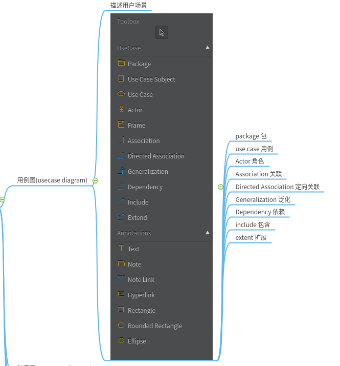

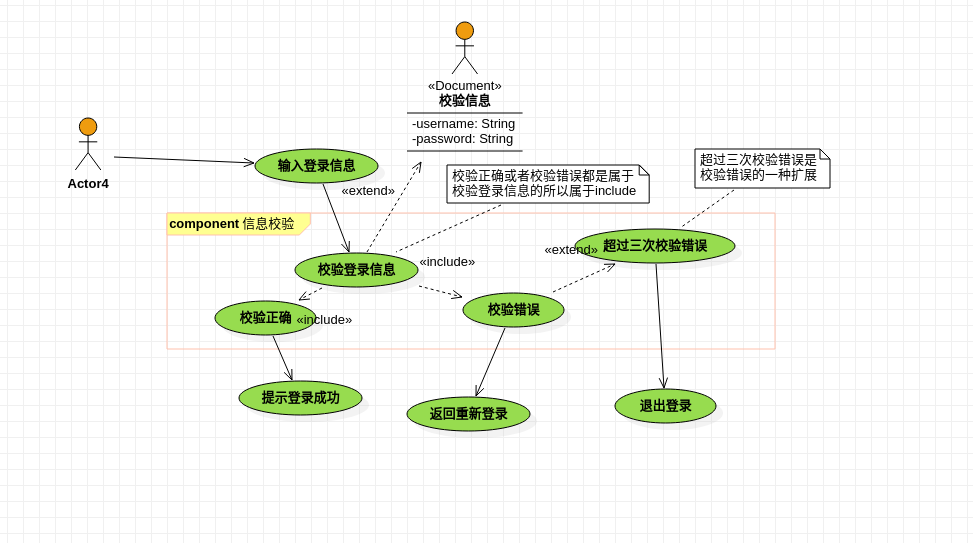

## 状态图

- 状态图是用来描述状态变化的图形

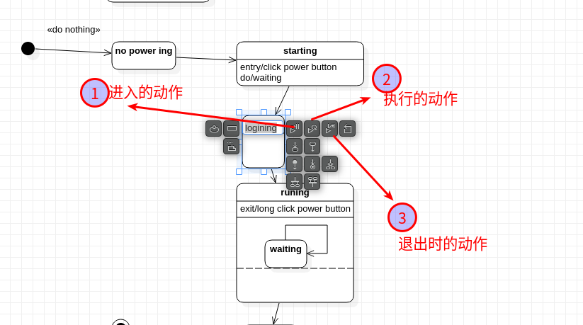

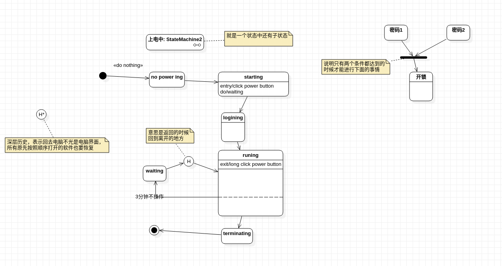

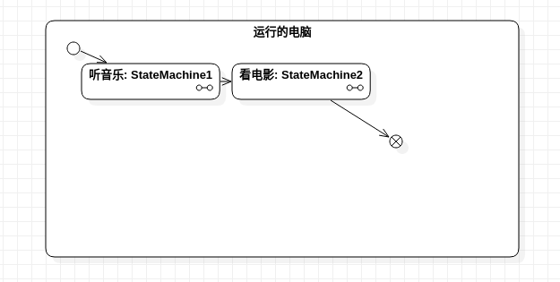

## 时序图

- 描述一个时间段的不同业务角色之间的业务流程

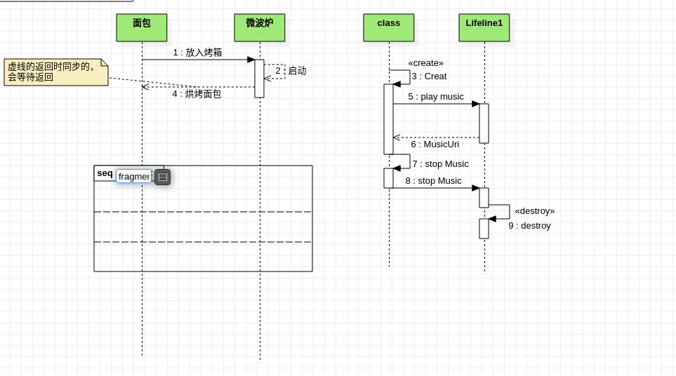

## 活动图

- 和常用的流程图一样，描述一个活动

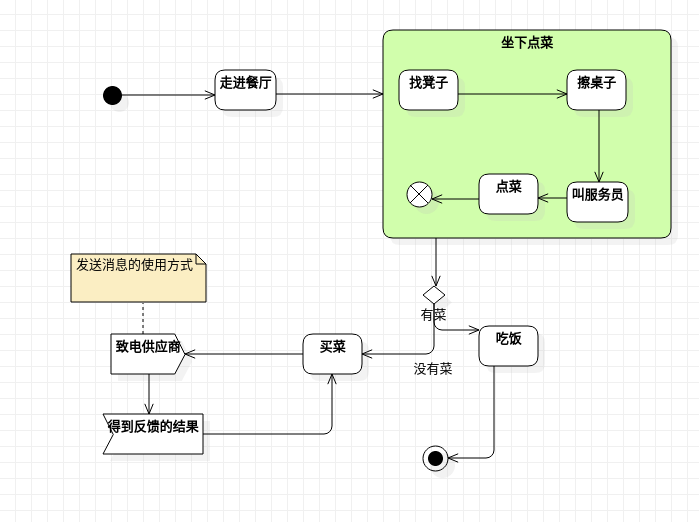

## 类图

- 默认值直接在类型后加`=`之后赋值，入参的默认值也一样
- 勾选是抽象类的时候，类的名字会变成斜体

- 勾选`isLeaf`说明是子类，下面不应该再有子类了

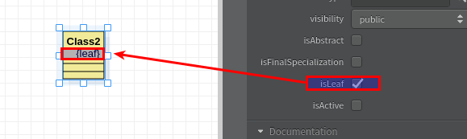

- `interface`在`UML`中类接口只是类的一种特殊形式，枚举也是

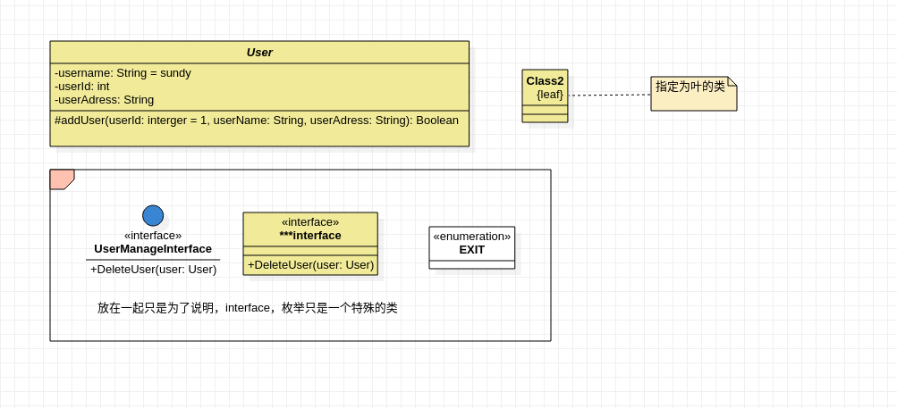

- 接口不能实例化对象，需要使用类去实现，接口中最多只能放置`static`或`final`类型的变量，其他类型的变量不能放置
- 使用类去实现接口

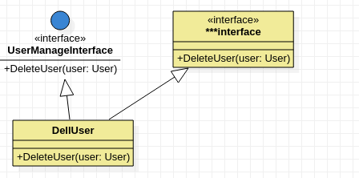

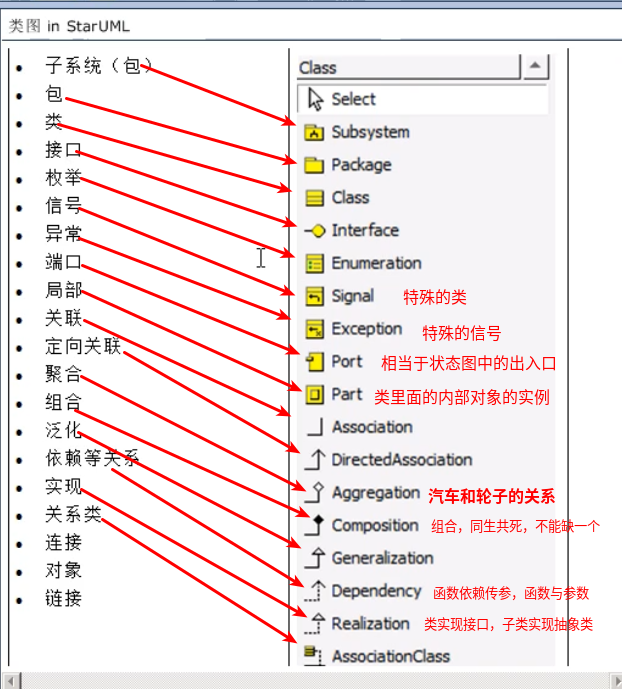

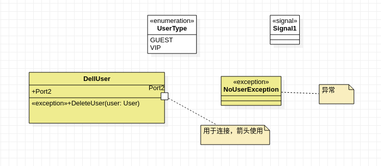

**聚合和组合**

- 聚合空心菱形箭头 -- 部门与员工--执行聚合成的物体

- 组合实心菱形箭头 -- 车与轮胎，车报废了轮胎也没用了--执行组合成的物体

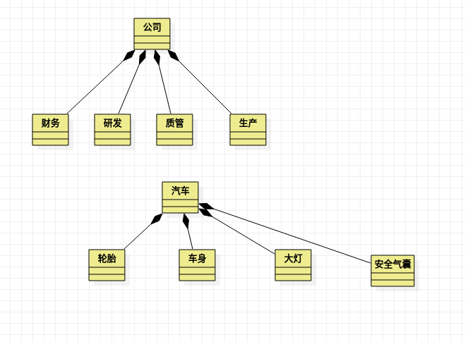

**继承**

- 继承由子指向父

**依赖**

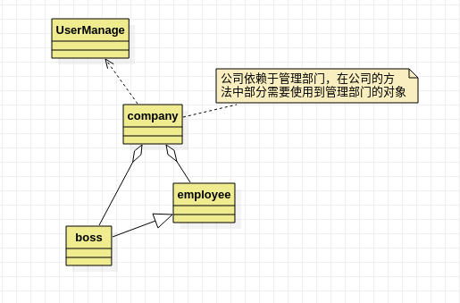

## 组件图

- 组件组件是软件系统的一个物理单元数据文件、表格、可执行文件、动态链接库等都被定义为组件，定义系统组件，接口及关系的图就是组件图
- 用于表示实现的资源的关系，主要关注的软件结构这一块

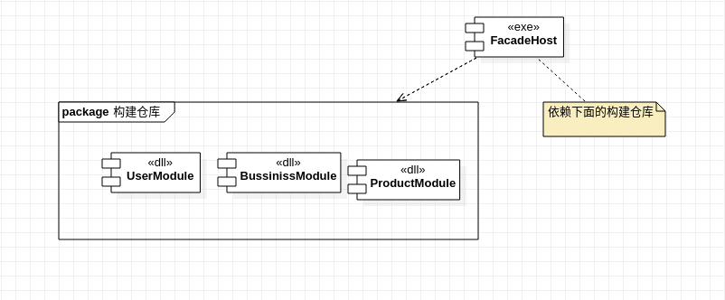

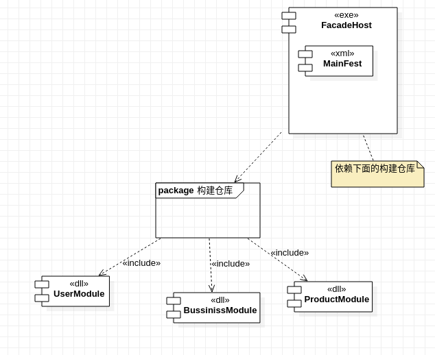

## 部署图

- 部署图反映了工件如何在系统硬件上发布

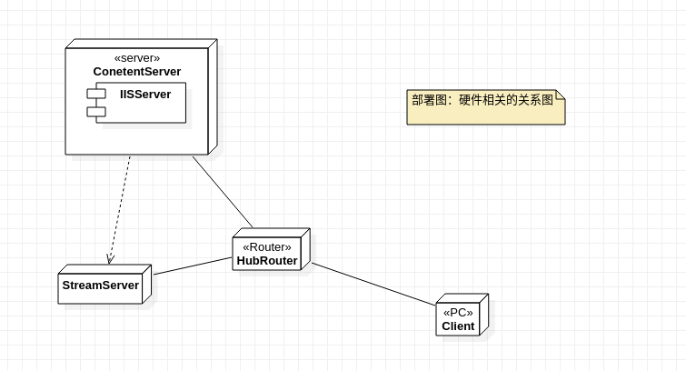

