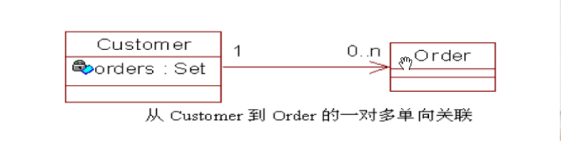
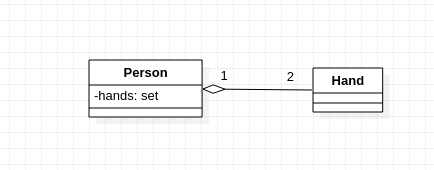
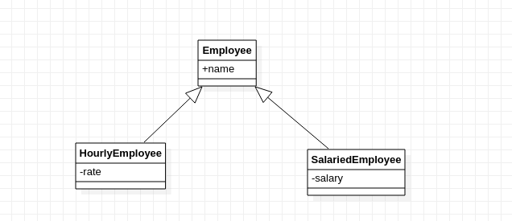

## `OOAD`与`UML`


**面向对象**

- 面向对象(Object-Orientation, 简称`OO`)是一种系统建模技术面向对象编程简称`OOP`
- 通过分析系统内对象的交互来描述或建模的一个系统
- 交互的对象最终是以类的形式组织
- `OO`的方法由三部分组成
  1. 过程
  2. 标识
  3. 规则

**对象**

- 客观存在的，唯一的实体
- 是面向对象编程过程中分析和解决问题的出发点和基础
- 拥有自己的标识、数据与行为
- 可以简单或负责
- 可以抽象或具体
- 在`OOP`中是一个类的动态实例

**类**

- 类是对象的模板
- 对象通过类实例化产生
- 一个类可以创建多个对象

**`OOAD`**

`OOAD`是根据`OO`的方法学，对软件系统进行分析和设计的过程

- `OOA`分析阶段
- `OOD`设计阶段

**`OOA`**阶段主要解决以下问题

- 建立针对业务问题域的清晰视图
- 列出系统必须要完成的核心任务
- 针对问题域建立公共词汇表
- 列出针对此问题的最佳解决方案
- 核心 - `What to do?`

**`OOD`**阶段主要解决以下问题

- 如何解决具体业务的问题
- 引入系统工作所需要的支持元素
- 定义系统的实现策略
- 核心- `How to do?`

**`OOP`主要特征**

- 抽象
- 封装
- 继承
- 多态
- 关联
- 聚合
- 组合
- 内聚域耦合

**抽象**

忽略掉一个对象或实体的具体细节而只关注其本质特征的过程

**        封装**

- 隐藏数据和实现
- 提供公共方法供用户调用功能
- 对象的两种视图

1. 外部视图-对象能够做的工作
2. 内部视图-对象如何完成工作

**继承**

- 通过存在的类型定义新类型的机制
- 通常在两个类型之间存在`is a`或`kind of`这样的关系
- 通过继承可以实现代码的重用，另外继承也是多态的基础

**多态**

- 一个名称多种形式
- 基于继承的多态
- 调用该方法根据所给的对象的不同选择不同的处理方式

**关联**

- 对象之间交互时的一种引用方式
- 当一个对象通过另外一个对象的引用去使用另外一个对象的服务或操作时，两个对象之间便产生了关联
- 如`person`使用`computer`，`person`和`computer`之间就产生了关联

**聚合**

- 关联关系的一种，一个对象成为另外一个对象的组成部分
- 是一种较强的关联关系
- 两个对象之间存在`has a`这样的关系，一个对象作为另外一个对象的属性存在
- 如汽车和轮胎-轮胎作为汽车的一个组成部分，轮胎和汽车都是可以单独生产的，汽车也是可以随意更换同等规格的轮胎

**组合**

- 当一个对象包含了另一个对象时，外部对象负责管理内部对象的生命周期的情况
- 关联关系中最为强烈的一种
- 内部对象的创建由外部对象自己控制
- 外部对象不存在时，内部对象也不能存在
- 如电视和显示器

**域模型**

- 域模型是面向对象的。在面向对象的术语中，域模型也可称为设计设计模型。域模型由以下内容组成：

1. 具有装填和行为的域对象

2. 域对象之间的关系

   - 关联
   - 依赖
   - 聚集
   - 一般化-泛华

   **关联**

  一个用户可以下多个订单，也可以有一个订单，一个用户和订单之间的关系就是关联


从`Order`到`Customer`的关联，一个用户可以定很多的订单，是一个多对一的关联，怎样`Order`关联到用户，需要在`Order`的类中建立`Customer`的成员变量。`Order`要能获得`Custormer`的信息



同理，`Customer`到`Order`的关联，`Customer`中需要定义`Order`的成员变量


也可以实现相互关联，两个对象中都有对方的成员变量。

**依赖关系**


`BusinessService`类依赖`Customer`类

在`BusinessService`类中有访问`Customer`类的防范，并且构造`Customer`类的实例

**聚集关系**

- 聚集关系是指整体和部分之间的关系，在实体域对象之间很常见



`Person`类和`Hand`类之间的聚集关系

**一般化关系**

- 一般化关系是指类之间的继承关系



`Employee`类之间的继承关系


==说明==

```bash
关联 Association
依赖 Dependency
聚集 Aggregation
一般化 Generalization
```

**内聚与耦合**

- 内聚-度量一个类独立完成某项工作的能力
- 耦合-度量系统内或系统之间依赖关系的复杂度
- 设计原则-增加内聚，减少耦合


## 软件开发过程概述

- 传统开发过程
  - 瀑布模型
- 统一软件开发过程(`USDP`)


